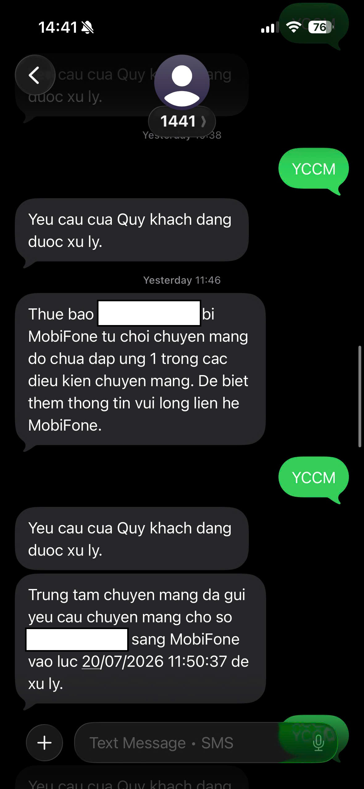
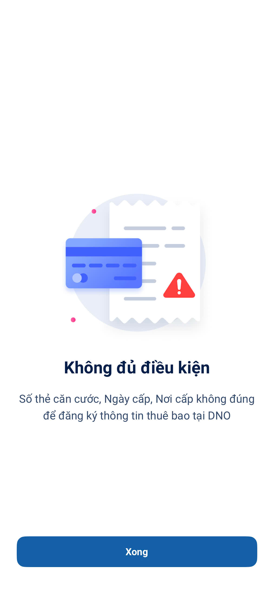
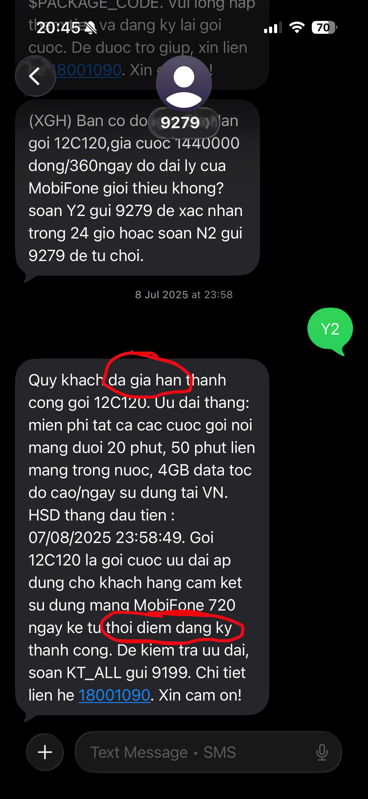
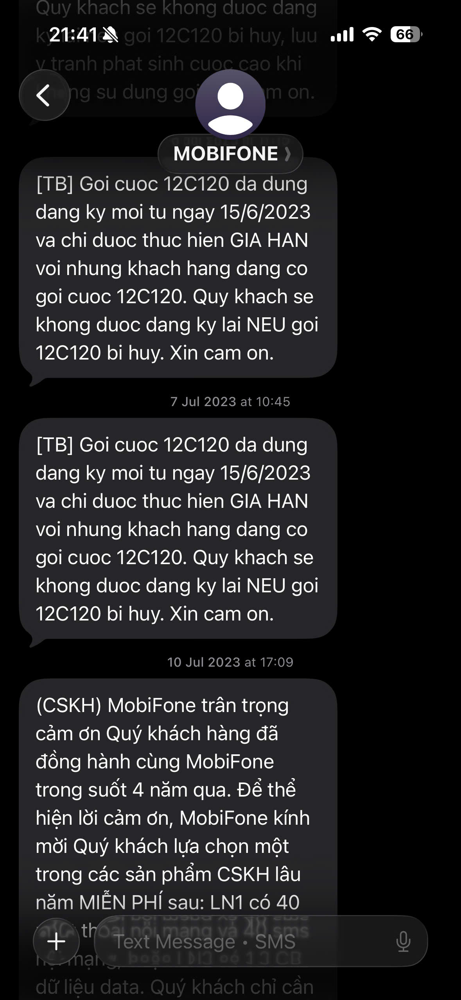

# Nhà mạng Mobifone ngăn cản quyền lợi chính đáng của khách hàng & sự vô trách nhiệm của nhân viên

## Tóm tắt nội dung

Mình là khách hàng dùng số Mobifone nhiều năm và muốn chuyển sang nhà mạng khác nhưng vẫn giữ nguyên số. Yêu cầu chuyển mạng của mình bị từ chối liên tục với lý do số của mình đang có "cam kết không chuyển mạng" - nhưng từ đó đến nay mình chưa từng được cung cấp bất kì văn bản hay bằng chứng nào về cái cam kết đó.

Từ ngày 20/07/2026 đến nay, mình đã ra cửa hàng nhiều lần, gọi tổng đài nhiều lần, lập biên bản khiếu nại có đóng mộc và gửi đơn lên các cơ quan chức năng. Kết quả: không một phản hồi chính thức nào bằng văn bản từ phía Mobifone về cam kết này của mình.

Bài viết này ghi lại 2 vấn đề:

1. **Mobifone ngăn cản quyền chuyển mạng giữ số của khách hàng** - từ chối yêu cầu mà không nêu căn cứ, không cung cấp bằng chứng về cam kết không chuyển mạng.
2. **Cách Lead cửa hàng Mobifone Hoàng Trọng Mậu xử lí khiếu nại** - hứa sẽ giải quyết, sau đó né tránh khách hàng và để toàn bộ deadline phản hồi đã cam kết trôi qua trong im lặng.

Mục đích của bài viết là lưu lại toàn bộ diễn biến để làm bằng chứng, đồng thời để những bạn đang gặp tình huống tương tự biết trước mình sẽ phải đối mặt với những gì.

## 1. Về việc nhà mạng Mobifone ngăn cản quyền lợi chính đáng của khách hàng (chuyển mạng giữ số)

### Diễn biến & bằng chứng

**a) Bị từ chối nhưng không được nêu lý do cụ thể**

Mỗi lần gửi yêu cầu chuyển mạng (YCCM), mình chỉ nhận được đúng một nội dung trả lời từ đầu số 1441:

> "Thue bao 09xx.xxx.xxx bi MobiFone tu choi chuyen mang do chua dap ung 1 trong cac dieu kien chuyen mang. De biet them thong tin vui long lien he MobiFone."



_Tin nhắn từ chối chuyển mạng, cho yêu cầu được Trung tâm chuyển mạng gửi sang Mobifone lúc 20/07/2026 11:50:37._

"Chưa đáp ứng 1 trong các điều kiện" - không nói là điều kiện nào, không dẫn căn cứ, không kèm văn bản. Sau khi liên hệ Mobifone thì luôn nhận được câu trả lời là có cam kết không chuyển mạng 720 ngày nhưng nhà mạng chưa đưa ra được bất kì văn bản nào chứng minh cam kết này có tồn tại.

**b) Lý do hiển thị trên app My MobiFone lại là một lý do khác**



_App My MobiFone: "Không đủ điều kiện - Số thẻ căn cước, Ngày cấp, Nơi cấp không đúng để đăng ký thông tin thuê bao tại DNO"._

Cùng một thuê bao, cùng một nhu cầu chuyển mạng, nhưng mỗi kênh của Mobifone lại đưa ra một lý do khác nhau:  app thì nói sai thông tin căn cước, còn cửa hàng và tổng đài thì nói do "cam kết không chuyển mạng". Ba lý do, không lý do nào được chứng minh bằng văn bản.

**c) Mobifone nói cam kết đến từ việc gia hạn gói 12C120 - nhưng chính tin nhắn của Mobifone lại nói ngược lại**

Đây là tin nhắn xác nhận giao dịch gói 12C120 ngày 08/07/2025 mà phía Mobifone dựa vào để kết luận mình đang có cam kết 720 ngày không chuyển mạng:



> "Quy khach **da gia han** thanh cong goi 12C120. (...) Goi 12C120 la goi cuoc uu dai ap dung cho khach hang cam ket su dung mang MobiFone 720 ngay **ke tu thoi diem dang ky** thanh cong."

Hai điểm mấu chốt nằm ngay trong tin nhắn do Mobifone gửi:

1. Giao dịch ngày 08/07/2025 là **gia hạn**, không phải **đăng ký mới**.
2. Mốc 720 ngày được tính "kể từ **thời điểm đăng ký** thành công", chứ không phải kể từ thời điểm gia hạn.

**d) Và gói 12C120 thì đã không thể "đăng ký mới" từ năm 2023**



> "[TB] Goi cuoc 12C120 da dung dang ky moi tu ngay 15/6/2023 va chi duoc thuc hien GIA HAN voi nhung khach hang dang co goi cuoc 12C120. Quy khach se khong duoc dang ky lai NEU goi 12C120 bi huy."

Nghĩa là từ 15/06/2023, mọi giao dịch 12C120 của mình chỉ có thể là gia hạn. Suy ra "thời điểm đăng ký thành công" của mình bắt buộc phải nằm trước 15/06/2023, và mốc 720 ngày cam kết (nếu thực sự tồn tại) cũng đã kết thúc từ rất lâu trước khi mình gửi yêu cầu chuyển mạng ngày 20/07/2026.

Tóm lại, kết luận "gia hạn gói 12C120 là có kèm 720 ngày không MNP" mà mình nhận được (xem mục 2) không khớp với chính nội dung tin nhắn mà Mobifone đã gửi cho mình. Và đến giờ mình vẫn chưa nhận được bất kỳ văn bản nào chứng minh cam kết đó tồn tại, cũng như thời điểm nó bắt đầu và kết thúc.

### Khiếu nại lần 2

Sau vài lần bị từ chối yêu cầu chuyển mạng, cộng thêm việc kết quả giải quyết đơn khiếu nại lần 1 theo mình là không hợp lí, mình quyết định gửi đơn khiếu nại lần 2 lên **Trung tâm chuyển mạng Quốc gia**. Lần này mình gửi song song cho cả các cơ quan chức năng có thẩm quyền khác theo gợi ý tại [bài viết này trên voz](https://voz.vn/t/hanh-trinh-chuyen-mang-giu-so-trai-nghiem-tu-mobifone-sang-viettel.1037574/):

- Thanh tra Chính phủ
- Thanh tra Bộ Khoa học & Công nghệ
- Thanh tra Cục Viễn thông

> Nội dung đơn các bạn có thể tham khảo tại file [redacted.pdf](redacted.pdf).

Một vài email mình dùng có khác so với bài viết trên voz. Danh sách cụ thể như bên dưới - tất cả đều được công khai trên website của các cơ quan nhà nước:

**To:**

```text
18006099@vnta.gov.vn
contact@vnta.gov.vn
vanthuthanhtra@mic.gov.vn
tonghop@mst.gov.vn
stc@mst.gov.vn
banbientap@thanhtra.gov.vn
```

**CC:**

```text
cuongnd@thanhtra.gov.vn
tridh@thanhtra.gov.vn
tuntt@thanhtra.gov.vn
hangttt@thanhtra.gov.vn
trungtq@thanhtra.gov.vn
hmhiep@mst.gov.vn
ntminhphuong@mst.gov.vn
dhha@mst.gov.vn
ddro@mst.gov.vn
tdanh@mst.gov.vn
```

## 2. Về cách xử lí vấn đề của Lead cửa hàng Mobifone Hoàng Trọng Mậu

> **Toàn bộ cuộc trò chuyện ngày 22/07/2026 đều được ghi âm lại, dài ~ 2h nên không tiện upload.**

- **Ngày 20/07/2026:** sau khi bị từ chối yêu cầu chuyển mạng nhiều lần mà không nêu nguyên nhân, mình ra cửa hàng Mobifone Hoàng Trọng Mậu và gặp một nhân viên (mình đã quên tên, tạm gọi là A). Phần giải thích mình nhận được thì vô cùng bất hợp lí và không giải quyết được gì nên mình ra về.

- **Ngày 22/07/2026:** mình quay lại cửa hàng, lần này yêu cầu gặp Lead của Mobifone Hoàng Trọng Mậu (anh NTN). Anh tiếp nhận và đưa ra hướng giải quyết mà thời điểm đó mình thấy khá hợp lí: anh sẽ gửi email đến bộ phận liên quan để gỡ cam kết không chuyển mạng. Nghe rất hứa hẹn. Nhân tiện hôm đó mình lập luôn 2 biên bản khiếu nại có đóng mộc của Lead cửa hàng Mobifone để có bằng chứng gửi cho cơ quan chức năng nếu như không giải quyết được:

  1. **Đơn khiếu nại về việc từ chối yêu cầu chuyển mạng** (2 bản), chốt phản hồi chậm nhất ngày 29/07/2026. Đúng hạn, mình nhận được phản hồi - qua tin nhắn:

     > "Còn ck ko mnp thì anh có gởi thì theo đúng nội dung gia hạn gói 12c120 là có kèm 720 ngày không mnp nên cty không gỡ đc cho em nhé"

     Không kèm bằng chứng, không kèm văn bản, không kèm bất cứ thứ gì chứng minh kết luận này đến từ Mobifone - trong khi chính tin nhắn gia hạn gói 12C120 của Mobifone lại ghi rõ mốc 720 ngày được tính từ "thời điểm đăng ký thành công", và gói này đã dừng đăng ký mới từ 15/06/2023 (xem bằng chứng ở mục 1). Mình có xin phản hồi bằng văn bản đóng dấu để làm bằng chứng khiếu nại - và đó là câu hỏi cuối cùng của mình được ghi nhận nhưng không được trả lời. Đỉnh điểm: mình qua cửa hàng Mobifone Hoàng Trọng Mậu **4 lần**, và cả 4 lần anh NTN đều "không có mặt". Ngày 30/07/2026 mình nhắn tin xin **một ngày bất kì** để qua lấy biên bản phản hồi. Tin nhắn đó đến giờ vẫn chưa được rep.

  2. **Đơn khiếu nại về nhân viên A** (1 bản) về thái độ và ứng xử với khách hàng chưa phù hợp, chốt phản hồi chậm nhất ngày 12/08/2026. Deadline đã trôi qua trong yên bình. Không phản hồi, không xin lỗi, không một dòng thông báo.

- **Ngày 29, 30, 31/07/2026:** mình gọi tổng đài Mobifone và ra cửa hàng liên tục để xin bằng chứng về cam kết không chuyển mạng. Mỗi lần đều được hẹn "phản hồi trong vòng 3 ngày kể từ lúc phản ánh, có thể kéo dài hơn nếu cần xác minh nhiều bộ phận". Mobifone đúng là bậc thầy câu giờ, tức là có thể kéo dài vô thời hạn và mình vẫn không thể nhận được bất kì câu trả lời nào.

- **Riêng ngày 31/07/2026:** mình ngồi tại cửa hàng Mobifone Hoàng Trọng Mậu gọi điện phản ánh về tổng đài Mobifone về việc Lead cửa hàng liên tục có thái độ trốn tránh khách hàng, không làm đúng trách nhiệm nhưng vẫn không nhận được phản hồi nào về phản ánh này.

---

## Cam kết

- Toàn bộ nội dung mình chia sẻ ở trên là sự thật. Phía Mobifone nếu muốn xác minh thì có thể liên hệ trực tiếp anh NTN.
- Các mốc thời gian diễn ra sự kiện có thể lệch 1-2 ngày, vì sự việc đã gần 1 tháng nên mình không nhớ chính xác tuyệt đối. Riêng các mốc thời gian cam kết phản hồi ghi trong đơn khiếu nại thì hoàn toàn đúng.

## Kinh nghiệm riêng

- Đơn khiếu nại (có dấu mộc của Lead cửa hàng) chỉ là tờ giấy lộn, không hơn không kém.
- Quyền lợi khách hàng đối với Mobifone thua cả đáy hang MU.
